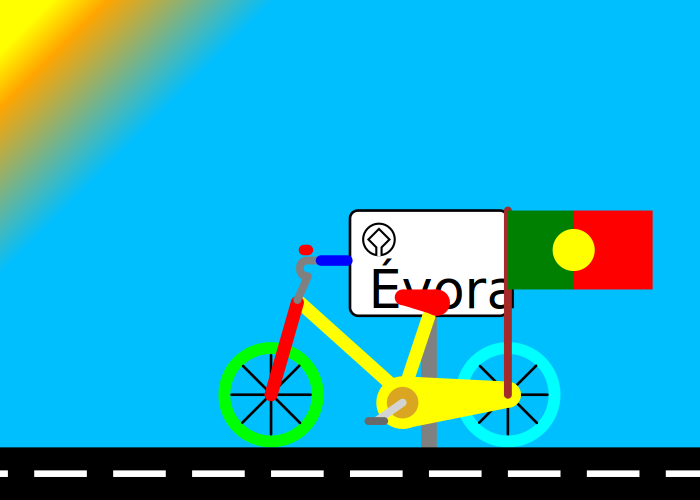

# **Trabalhos de Computação Grafica**
## Estes repositorio é comosto por 4 pastas que representam os 4 trabalhos efetuados para a disciplina de computação grafica
---
## **SVG**
  

---
## **3JS**
<html>
	<head>
		<title>48402-3JS</title>
		<meta charset="utf-8">
        
        
	</head>
	<body>
        <!--<h1>Trabalho de 48402 - 3JS</h1>-->
        
	</body>
</html>
  

---
## **X3d**
  

---
## **C2D**  
<html>
<head>
    <meta charset="utf-8" />
    <title>48402 - C2D</title>
    
    
</head>
<body>
    

 
    <canvas  id="canvas" >
        
    </canvas>
   
</body>
</html>
   

